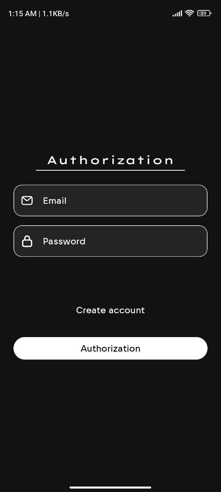
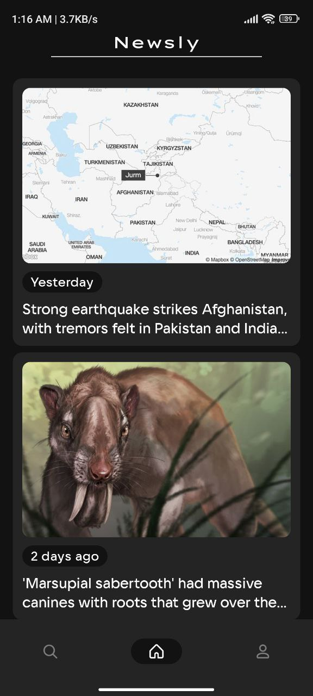
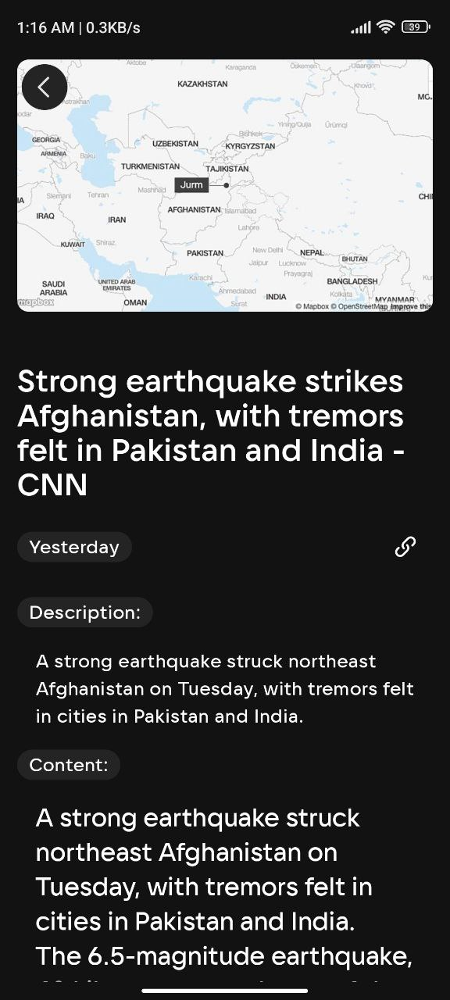
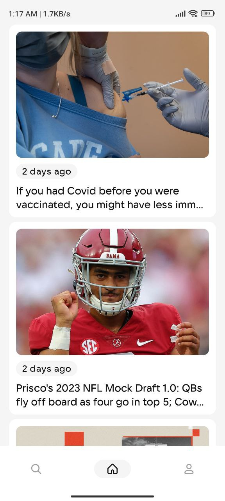
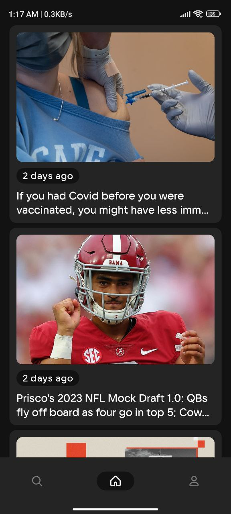
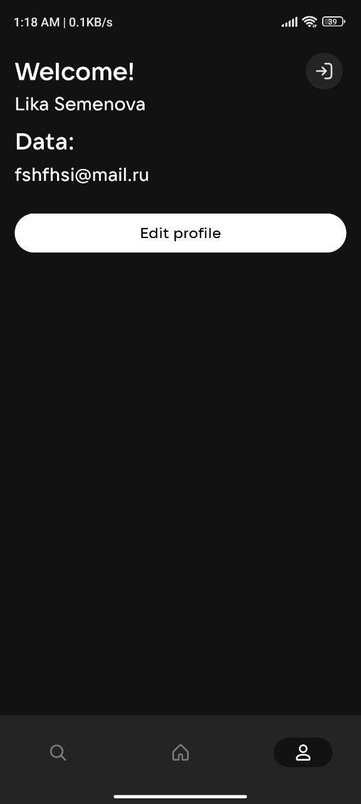
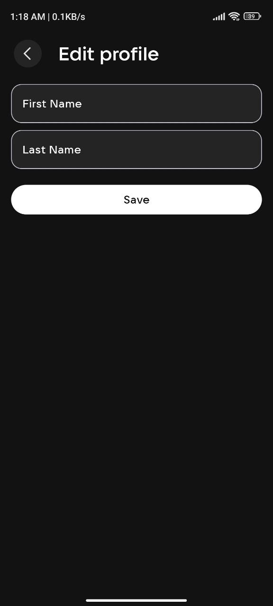
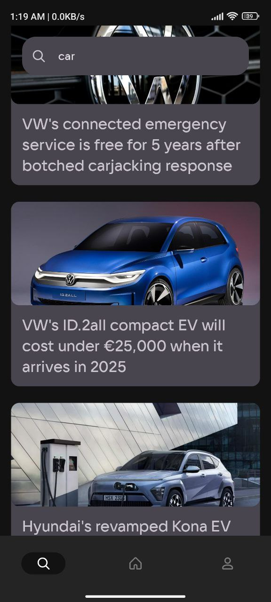

# Newsly Android App

## Screenshots

## Authentication screens

|                       Authorization                       |                       Registration                       |
|:---------------------------------------------------------:|:--------------------------------------------------------:|
|  |  |

## Main screen

|                      Home                       |
|:-----------------------------------------------:|
|  |

## Details screen

|                    Cars details                    |
|:--------------------------------------------------:|
|  | 

## Light/Dark themes

|                         Light Theme                         |                         Dark theme                         |
|:-----------------------------------------------------------:|:----------------------------------------------------------:|
|  |  |

## Profile screen

|                   Profile                   |                   Edit profile                   |
|:-------------------------------------------:|:------------------------------------------------:|
|  |  |

## Search screen

|                      Search                       |
|:-------------------------------------------------:|
|  |

## How to run
* You need Android Studio (at least Arctic Fox) with Kotlin plugin (at least 1.6.10)
* Add `apiKey=<YourKey>` in `local.properties` file, for example `apiKey="96766ee982e642d7957abb90a7559838"`
* Run -> Run 'app'

## Known issues
* The used API has quite hard limits for developers

## Topics
* DI
* Navigation
* Architecture
* Paging
* Theming
* Single-module
* Compose Based UI
* Authentication with Firebase

## My contacts
* [VK](https://vk.com/liker4ik50)
* [Telegram](https://t.me/Liker4ik50)